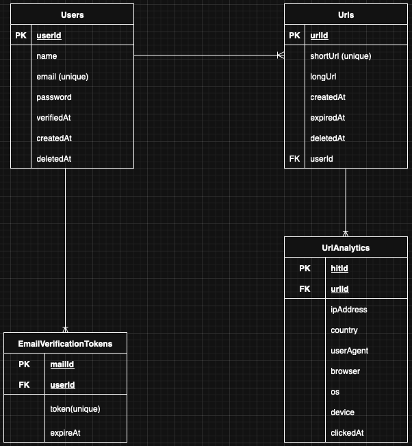

## Data modeling :

The following data modeling consists the blueprint for the url-shortener project and describes how data should be structured, organized, and related within this project.

The process involves defining entities (objects), their attributes (characteristics), and relationships (connections)

| Entity                 | Description                           |
| ---------------------- | ------------------------------------- |
| Users                  | Registered user with verified email.  |
| Urls                   | Shortened URL belonging to a user.    |
| UrlAnalytics           | Each time a shortened URL is visited. |
| EmailVerificationTokens| Token to verify user email.           |

For user:

| Field     | Type            | Description           |     
| --------- | --------------- | --------------------- |  
| id        | UUID            | Primary key           |     
| name      | string          | User’s name           |     
| email     | string (unique) | User email            |     
| password  | string          | Hashed password       |     
| verifiedAt| timestamp       | Email verified time   |     
| createdAt | timestamp       | User created time     |     
| deletedAt | timestamp       | User deleted time     |     

For email authentication :

| Field        | Type      | Description     |
| ------------ | --------- | --------------- |
| id           | UUID      | Primary key     |
| userId       | UUID (FK) | Associated user |
| token(unique)| string    | Unique token    |
| expiryAt     | timestamp | Expiration date |

For each Url:

| Field      | Type            | Description          |
| ---------- | --------------- | -------------------- |
| id         | UUID            | Primary key          |
| shortUrl   | string (unique) | Generated short code |
| longUrl    | text            | Original URL         |
| expiryAt   | date            | Expiration date      |
| userId     | UUID (FK)       | Reference to `User`  |
| createdAt  | timestamp       | Url created time     |
| deletedAt  | timestamp       | Url deleted time     |   

For Url analytics: 

| Field     | Type      | Description        |
| --------- | --------- | ------------------ |
| id        | UUID      | Primary key        |
| urlId     | UUID (FK) | Reference to `Url` |
| ipAddress | string    | Visitor IP         |
| country   | string    | Parsed from IP     |
| userAgent | text      | Raw user agent     |
| browser   | text      | Visitor browser    |
| os        | text      | Operating system   |
| device    | text      | Visitor Device info|
| clickedAt | timestamp | Timestamp of visit |

### **Relationship between them**

1. Users (1) → (M) Urls
2. Urls (1) → (M) UrlAnalytics
3. Users (1) → (1) EmailVerificationTokens

## Entity Relation Diagram

